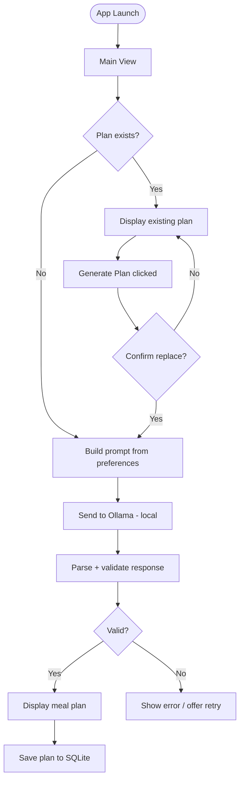
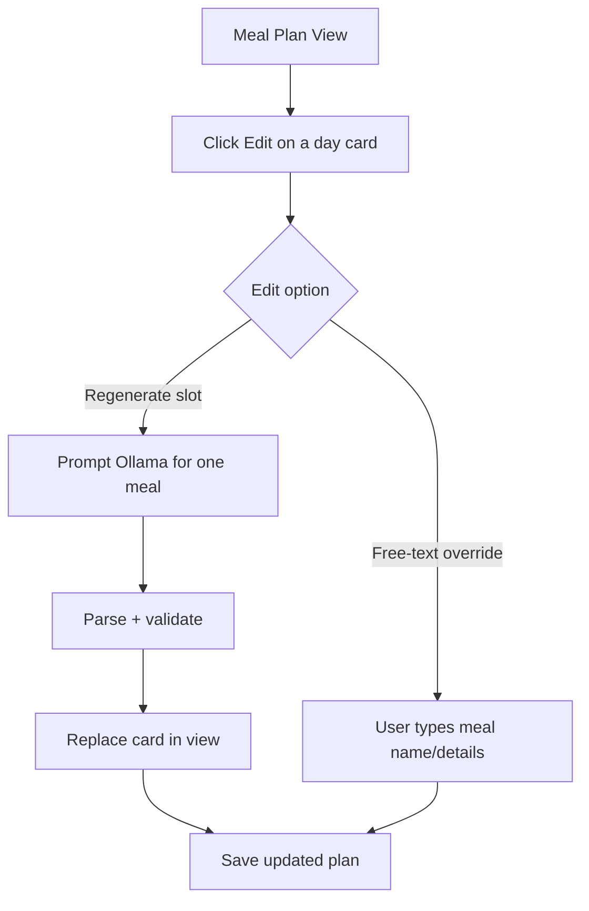
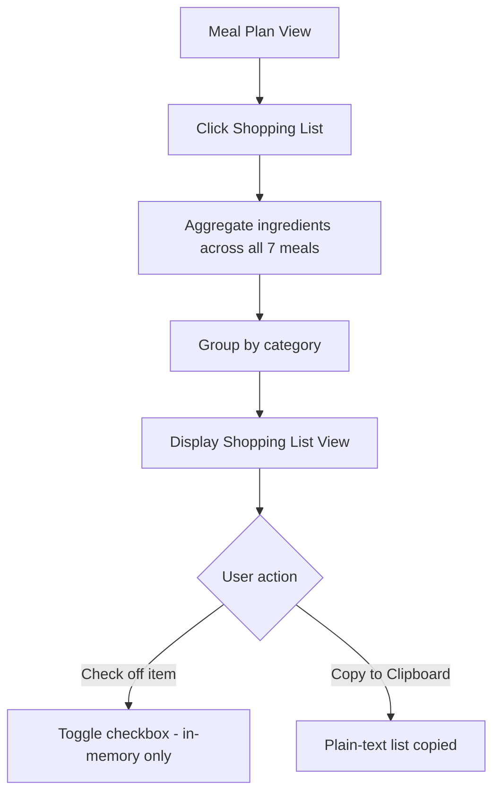
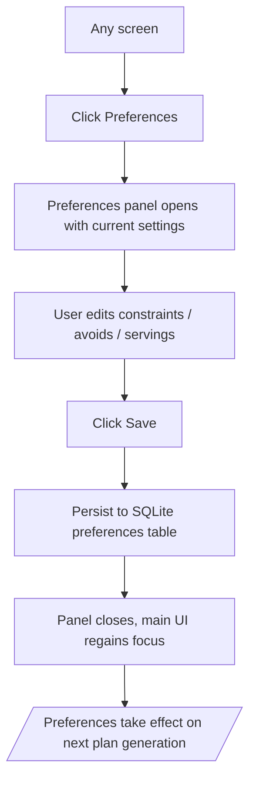
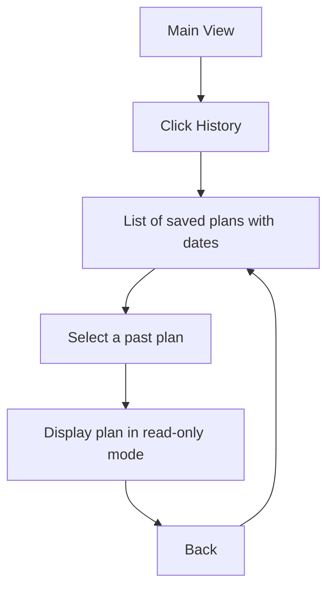

# User Flows

## Flow 1 — Generate a Meal Plan

---

## Flow 2 — Edit a Single Meal

---

## Flow 3 — View Shopping List

---

## Flow 4 — Update Preferences

---

## Flow 5 — View Plan History

