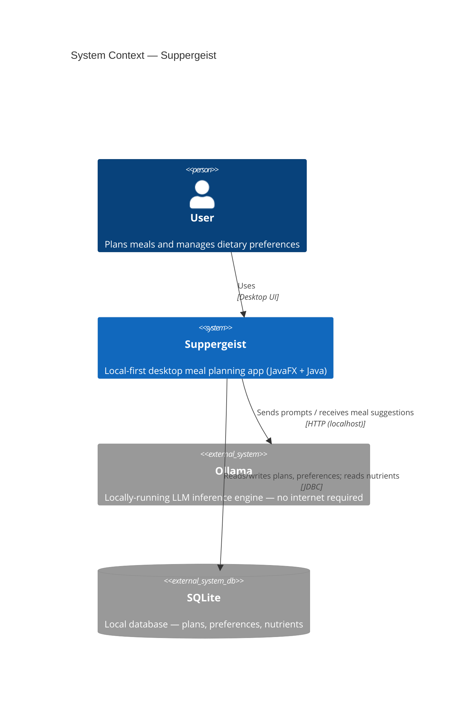

# System Context

## Context Diagram



---

## External Dependencies

| Dependency | Type | Role | Required at runtime? |
|------------|------|------|----------------------|
| Ollama | Local process | LLM inference for meal generation | Yes — must be running |
| SQLite (`nutrients.db`) | File (read-only) | CoFID 2021 nutritional data | Yes — bundled |
| SQLite (`app.db`) | File (read-write) | User plans and preferences | Yes — created on first run |
| Java 21 JRE | Runtime | Executes the application | Yes |

---

## What Suppergeist Does NOT Depend On

- No internet connection at runtime
- No remote API keys or cloud services
- No external database server or daemon
- No separate backend process — the Java app is the backend

---

## Deployment Context

Suppergeist runs as a single desktop process on the user's machine. It is packaged via `jlink` into a self-contained image. The user is responsible for installing Ollama separately and ensuring a suitable model is pulled (e.g. `ollama pull llama3`).

```
User's Machine
├── Suppergeist (JavaFX desktop app)
├── Ollama (separate install, localhost:11434)
└── data/
    └── processed/nutrients.db   ← read-only, bundled
    └── app.db                   ← created on first run
```
